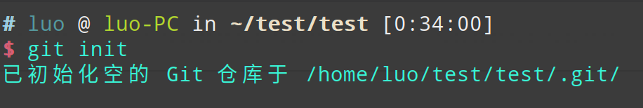
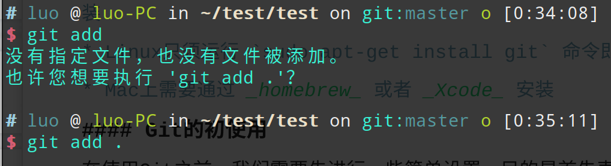
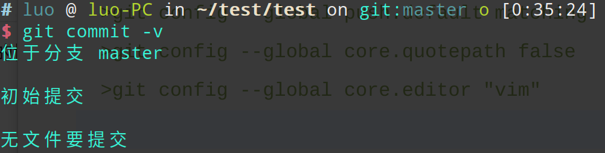

Git是一个分布式版本控制系统，最初是由林纳斯·托瓦兹创作。Github是一个基于Git的项目托管平台。
#### Git的安装
在Windows，Linux和Mac的安装方法各不相同。
* Windows上需要安装Git Bash，可直接从官网下载或者各镜像网站下载安装
* Linux只须运行 `sudo apt-get install git` 命令即可
* Mac上需要通过 _homebrew_ 或者 _Xcode_ 安装
#### Git的初使用
在使用Git之前，我们需要先进行一些简单设置，目的是首先表明身份。
  >git config --global user.name 你的英文名
  >git config --global user.email 你的邮箱
  >git config --global push.default matching
  >git config --global core.quotepath false
  >git config --global core.editor "vim" 

 ##### Git初始的几个命令
 `git init`
 
     这个命令是用初始化一个空的Git仓库。同时在当前目录下多了一个`.git`目录，是用于跟踪管理版本库。在初次使用时，请忽略这个目录，不要修改它，避免把Git仓库破坏。
     `git add`
     
     这个命令是告诉Git把变动添加到“暂存区”。但是请注意命令后面要有文件或者目录。当正确执行这个明令后，不会有任何显示。
     `git commit -v`
     
     这个命令是提交暂存区到仓库区。同时`git commit`可以接不同参数。
     > `-v`表示提交时显示所有diff信息，即两个文本文件的差异
     > `-m [message]`用来正式提交变动，提交至 .git 仓库
     > `-a` 表示提交工作区自上次commit之后的变化，直接到仓库区，不建议采用这种提交，因为会导致以后的回溯出现混乱

当然了，Git还有很多很重要的内容需要学习，**Fighting!**

 
 

采摘|参考文献：
* [大白话解释 Git 和 GitHub](http://blog.jobbole.com/111187/)
* [廖雪峰的Git教程](https://www.liaoxuefeng.com/wiki/0013739516305929606dd18361248578c67b8067c8c017b000)
* [常用 Git 命令清单](http://www.ruanyifeng.com/blog/2015/12/git-cheat-sheet.html)