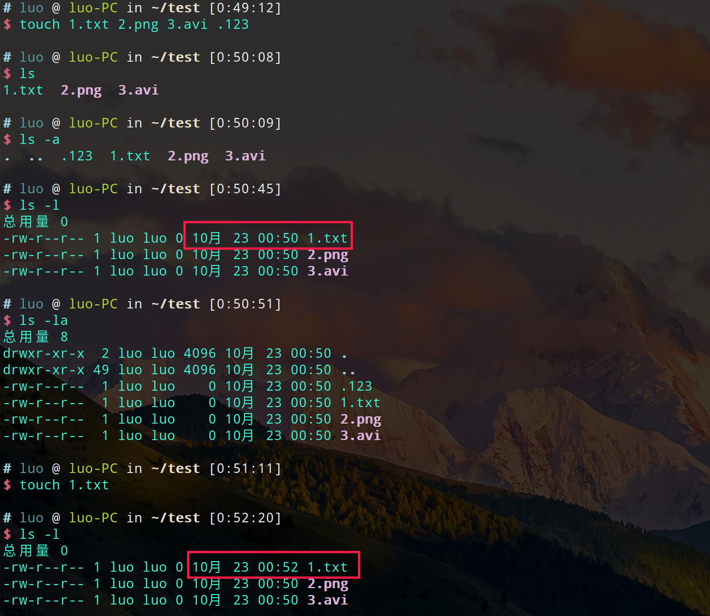
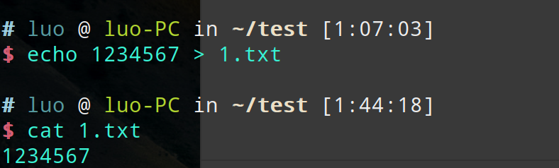
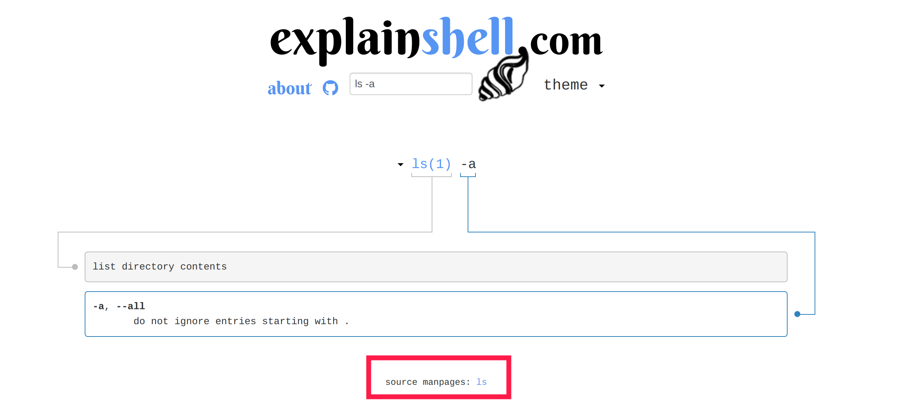

命令行是每一个开发者都会频繁使用的，与Windows图形界面所不同的是，命令行操作都是靠命令来执行的。下面列举了一些常用的一些命令，例如增删改查。

|命令	|全写	|缩写
|----|-----|----
|创建目录	|make directory	|mkdir
|删除	|remove	|rm
|移动/重命名	|move	|mv
|复制	|copy	|cp
|罗列	|list	|ls
|改变目录	|change directory	|cd

有些命令后面可以增加参数，达到不同目的。例如`ls`，表示列出目录下内容，常用参数有`ls -a`,`ls -l`,`ls -la`。`ls -a`表示列出目录下所有内容，包括以`.`开头的文件。`ls -l`表示以长列表列出目录下内容，包括内容权限，用户，修改时间等。如图所示。

在图片中，使用`touch`命令，touch为触摸意思，当touch的文件不存在时，会创建该文件。当文件存在时，touch会更新文件的修改时间，如上图红框时间不同。
`mv`这个命令有移动/重命名意思，当不同路径时为移动，相同路径为重命名。
>#`mv 1.txt ./1/2/`操作为把`1.txt`从当前目录移动到`./1/2/`目录下；
>#`mv 1.txt 2.txt`操作为把`1.txt`重命名为`2.txt`

`cat`这个命令操作为连接文件并在标准输出上打印。

命令何其多，如果忘了某个命令可以Google。当看到某一个命令不知道为何意时，我们可以用`man +命令`来获得这个命令的相关参考手册，或者`tldr +命令`，`tldr`翻译是太长不读，可以通过`npm i -g tldr`安装这个工具。当然也可以通过[explainshell](https://explainshell.com/)这个网站来查找命令解释。

特别当解释还有疑惑时，可以点击红框内的_source manpages_ ，可以跳转到官方手册页。

命令行是常用常熟，不用惧怕一开始好像什么都不会，不会就用搜索引擎查找。 
**Fighting!**

